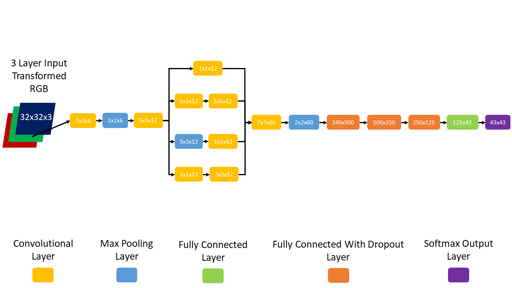

# Classifying Traffic Signs with a Convolutional Neural Network and Tensorflow 

### Overview
This repository demonstrates using tensorflow to build and train a simple convolutional neural network which can classify 43 different types of traffic signs. The project was completed as part of the Udacity Self Drving Car nanodegree program. The resulting network was trained to an accuracy of 98% and performed with an accuracy of 92% on hodout test data. In addition, the network was able to correctly classify picutres of signs not including n training or test data that were partially obscured by grafiti or snow. In addition, some extra pictures were fed though the network to see how it would respond to images far outside the training bounds. 

### Some examples: 
* The network correctly classifed this image as "speed limit 30 kph"

* And this image correctly as "yeild"

* And apparently there's a 76% chance I'm a road work sign. See the resemblance?:

               

### Launch the Ipython notebook here: 
https://github.com/andrewsommerlot/Traffic-Sign-Classifier/blob/master/traffic-sign-classifier.ipynb
